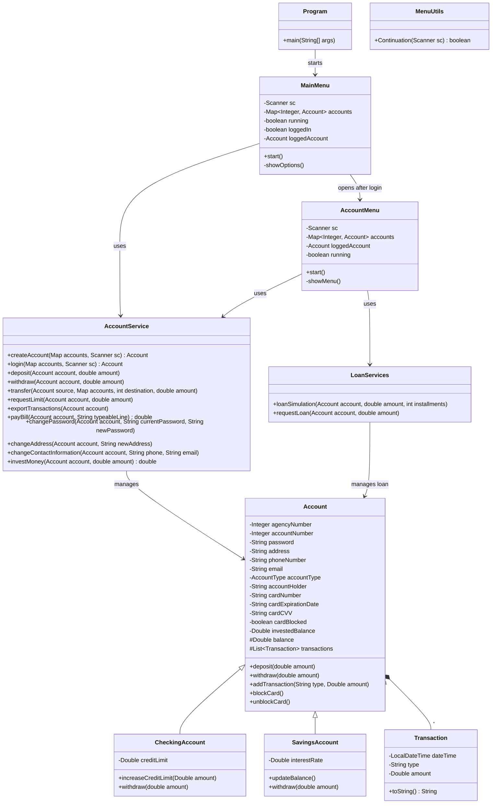
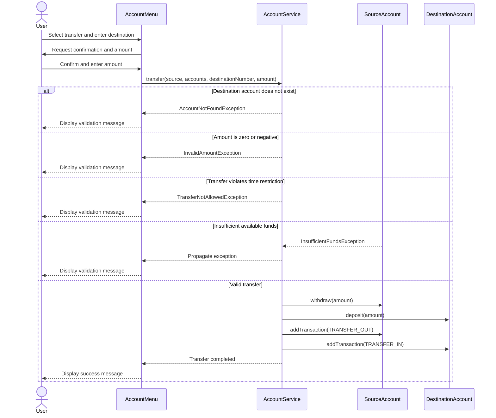
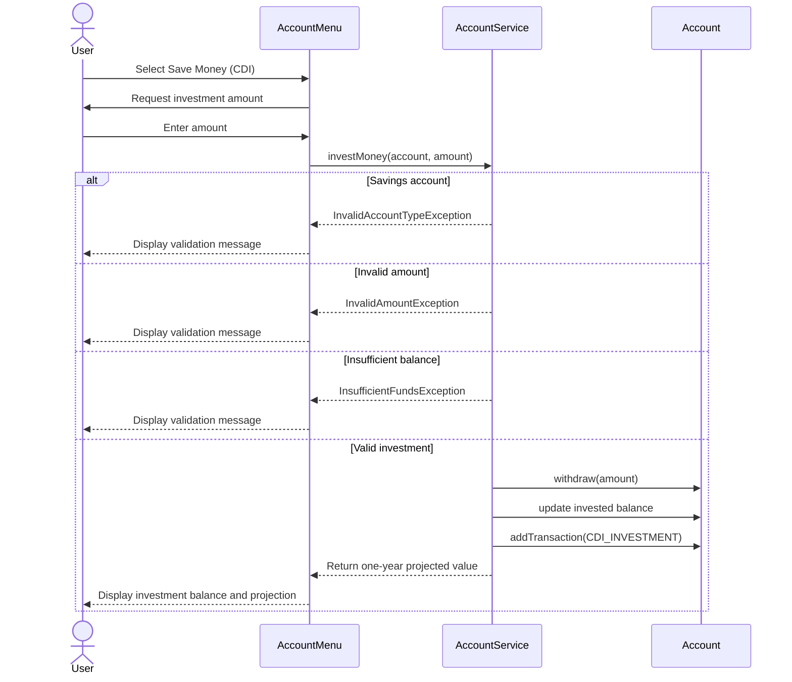

# Banking Challenge Java

A terminal-based banking application developed in Java as part of an Accenture programming challenge focused on Object-Oriented Programming, modular architecture, business validations, and software design best practices.

## Overview

The application simulates a banking system in memory. Users can create checking or savings accounts, authenticate with account number and password, perform banking operations, manage personal and card information, request financial products, invest money, and export transaction history to a CSV file.

The project applies separation of responsibilities across application, menu, service, entity, and exception packages. The `Program` class works as the application entry point, menu classes handle terminal interaction, services coordinate business operations, entities represent the banking domain, and custom exceptions describe validation failures.

## Features

### Account Management

- Create checking and savings accounts
- Register account holder, address, phone number, and email
- Validate duplicate account numbers
- Authenticate using account number and password
- Limit invalid password attempts
- Change password
- Change address
- Change phone number and email

### Banking Operations

- Deposit funds
- Withdraw funds
- Transfer funds between accounts
- Check account balance
- Check credit limit
- Request credit limit increase
- Reject zero or negative deposit, withdrawal, transfer, investment, and limit-increase values
- Prevent operations when available funds are insufficient

### Cards

- Automatically generate a card number when an account is created
- Automatically generate a CVV
- Automatically generate an expiration date five years from account creation
- Display card information
- Block a lost or stolen card
- Display card block status

> Card number, expiration date, and CVV are not included in the general account `toString()` output used during transfer confirmation.

### Loans

- Simulate a loan with installments, interest, and IOF calculation
- Display the effective loan cost and monthly payment
- Request a loan and deposit the requested amount into the account
- Register the loan deposit in transaction history
- Restrict the loan product to checking accounts

### Investments

- Save money in a CDI-based investment balance
- Restrict the investment product to checking accounts
- Validate the investment amount and available account balance
- Display the current invested balance
- Simulate the projected value after one year using the rate configured in the service
- Register the investment in transaction history

> The CDI projection is a simplified educational simulation and does not represent a real-time market rate or financial recommendation.

### Bill Payments

- Pay bills using a 47-character typeable line
- Extract the due-date factor and payment amount from the typeable line
- Apply overdue-payment adjustment
- Reject invalid or incomplete typeable lines
- Prevent payment when available funds are insufficient
- Register bill payments in transaction history

### Transactions

- Track deposits, withdrawals, transfers, loan deposits, bill payments, and CDI investments
- Timestamp every transaction
- Export account transaction history to a CSV file

### Transfer Restrictions

- Transfer amounts must be greater than zero
- The destination account must exist
- Transfers above R$ 1,000.00 are allowed only between 06:00 and 22:00
- The source account must have sufficient available funds

## Custom Exceptions

The project uses specific runtime exceptions instead of generic `IllegalArgumentException` handling:

- `AccountAlreadyExistsException`
- `AccountNotFoundException`
- `InsufficientFundsException`
- `InvalidAccountTypeException`
- `InvalidAddressException`
- `InvalidAmountException`
- `InvalidContactInfoException`
- `InvalidLoginException`
- `InvalidTypeableline`
- `TransferNotAllowedException`

Business validations are performed in services or domain entities. Menu classes catch the relevant exceptions and display their messages to the user.

## Technologies Used

- Java
- Eclipse IDE
- Git
- GitHub
- MermaidJS

## Programming Concepts Applied

- Object-Oriented Programming
- Inheritance
- Polymorphism
- Encapsulation
- Method overriding
- Enums
- Collections with `List` and `Map`
- Custom exception handling
- Service-layer separation
- Modular terminal menus
- File manipulation with CSV export
- Authentication
- Java Date and Time API
- In-memory data storage

## Project Structure

```text
src
├── application
│   └── Program.java
├── entities
│   ├── Account.java
│   ├── AccountType.java
│   ├── CheckingAccount.java
│   ├── SavingsAccount.java
│   └── Transaction.java
├── exceptions
│   ├── AccountAlreadyExistsException.java
│   ├── AccountNotFoundException.java
│   ├── InsufficientFundsException.java
│   ├── InvalidAccountTypeException.java
│   ├── InvalidAddressException.java
│   ├── InvalidAmountException.java
│   ├── InvalidContactInfoException.java
│   ├── InvalidLoginException.java
│   ├── InvalidTypeableline.java
│   └── TransferNotAllowedException.java
├── menu
│   ├── AccountMenu.java
│   ├── MainMenu.java
│   └── MenuUtils.java
└── services
    ├── AccountService.java
    └── LoanServices.java
```

## Architecture and Responsibilities

### `application`

Contains the application entry point. `Program` configures the locale, creates the in-memory account map and shared `Scanner`, and starts `MainMenu`.

### `menu`

Handles terminal input, navigation, confirmation prompts, success messages, and exception presentation.

- `MainMenu`: account creation, login, and initial navigation
- `AccountMenu`: authenticated banking operations
- `MenuUtils`: shared continuation behavior

### `services`

Coordinates business operations and validations.

- `AccountService`: account creation, login, deposits, withdrawals, transfers, credit limit requests, CSV export, bill payments, profile updates, and CDI investment
- `LoanServices`: loan simulation and loan request processing

### `entities`

Represents domain state and account-specific behavior.

- `Account`: common account, customer, card, balance, investment, and transaction data
- `CheckingAccount`: credit-limit behavior and withdrawal using balance plus credit limit
- `SavingsAccount`: interest-rate behavior and withdrawal limited to available balance
- `Transaction`: timestamped transaction record

### `exceptions`

Contains domain-specific runtime exceptions for invalid operations and business-rule violations.

## How to Run

### 1. Clone the repository

```bash
git clone https://github.com/ricardobfernandes/bank-challenge-java.git
```

### 2. Open the project

Import the project into Eclipse IDE as an existing Java project.

### 3. Execute

Run:

```text
application.Program
```

## How to Use

### Initial Menu

```text
1 - Create Account
2 - Log In To Your account
0 - Exit
```

### Create an Account

Provide:

- Account type
- Account holder name
- Initial balance
- Agency number
- Account number
- Password
- Address
- Cellphone number
- Email
- Credit limit for a checking account, or interest rate for a savings account

A card number, expiration date, CVV, and initial unblocked status are generated automatically.

### Authenticated Account Menu

```text
1  - Deposit
2  - Withdraw
3  - Transfer
4  - Check Balance
5  - Check Limit
6  - Request Limit
7  - Request Loan
8  - Transaction History
9  - Pay Bills
10 - Change Password
11 - Change Address
12 - Change Contact Information
13 - Block Card
14 - Show Card Information
15 - Save Money (CDI)
16 - Exit
```

## Transaction History

The CSV export uses the following columns:

```text
DateTime;Type;Amount
```

Example:

```text
17/08/2026 22:42:13;DEPOSIT;4500.0
17/08/2026 22:42:22;WITHDRAW;-4000.0
17/08/2026 22:44:01;LOAN_DEPOSIT;5000.0
17/08/2026 22:44:30;BILL_PAYMENT;-520.0
17/08/2026 22:45:10;CDI_INVESTMENT;-1000.0
```

The generated file follows this naming pattern:

```text
transactions_accountNumber_<account-number>.csv
```

## Bill Payment Examples

The typeable line must contain exactly 47 characters.

- Characters from position 33 to 36 represent the due-date factor used by the application
- The final 10 characters represent the payment amount in cents

Example 1:

```text
Value: R$ 500.00
Due date: 15/08/2026
75691305320108502503774915720010215390000050000
```

Example 2:

```text
Value: R$ 1,000.00
Due date: 25/08/2026
75691305320108502503774915720010215490000100000
```

## Class Diagram



## Sequence Diagram: Transfer Operation



## Sequence Diagram: CDI Investment



## Design Improvements

The current version includes the following architectural improvements:

- The original main-class menu flow was separated into `MainMenu`, `AccountMenu`, and `MenuUtils`
- Business operations and validations were moved to service classes or the appropriate account entities
- Generic argument exceptions were replaced by domain-specific exceptions
- Zero and negative financial values are rejected before account state is changed
- Checking and savings accounts apply different withdrawal rules through method overriding
- Terminal interaction remains in menu classes while business rules remain in services and entities

## Author

**Ricardo Fernandes**  
Product Engineering Analyst
