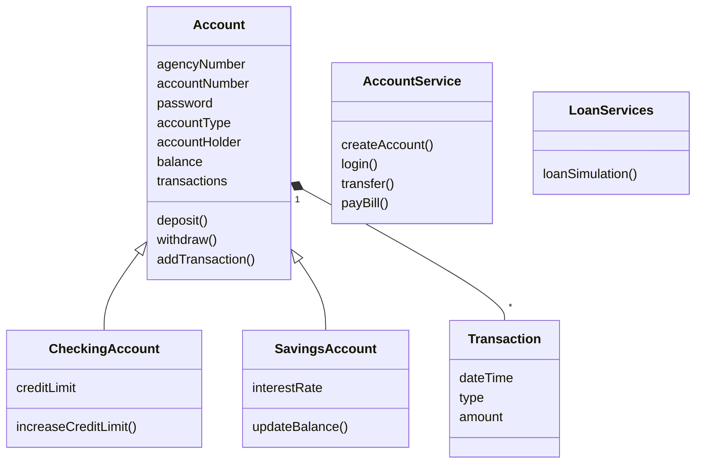
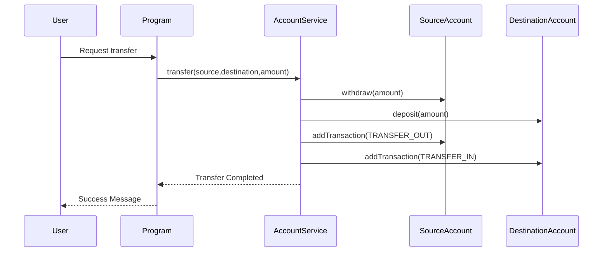

# Banking Challenge Java

A banking application developed in Java as part of a Accenture programming challenge focused on Object-Oriented Programming concepts and software design best practices.

## Overview

This application simulates a banking system that allows users to create accounts, authenticate with credentials, perform banking operations, and export transaction history.

The system was designed using Object-Oriented Programming principles such as inheritance, encapsulation, polymorphism, collections, file handling, and service-layer separation.

---

## Features

### Account Management

- Create bank accounts
- Login using account number and password
- Support for Checking Accounts and Savings Accounts

### Banking Operations

- Deposit funds
- Withdraw funds
- Transfer funds between accounts
- Check account balance
- Check credit limit
- Request credit limit increase

### Loans

- Loan simulation
- Loan request and automatic deposit of approved amount

### Bill Payments

- Bill payment using a typeable line (barcode representation)
- Automatic overdue payment calculation

### Transactions

- Transaction history tracking
- Export account transaction history to CSV file
- Timestamp registration for every transaction

### Security

- User authentication through account number and password
- Limited login attempts

### Transfer Restrictions

Transfers above R$ 1,000.00 are only allowed between:

```text
06:00 AM and 10:00 PM
```

---

## Technologies Used

- Java
- Eclipse IDE
- Git
- GitHub

---

## Programming Concepts Applied

- Object-Oriented Programming (OOP)
- Inheritance
- Polymorphism
- Encapsulation
- Enums
- Collections (List and Map)
- Exception Handling
- File Manipulation (CSV)
- Service Layer Pattern
- Authentication
- Date and Time API (`LocalDate`, `LocalDateTime`, `ChronoUnit`)

---

## Project Structure

```text
src
│
├── application
│   └── Program.java
│
├── entities
│   ├── Account.java
│   ├── CheckingAccount.java
│   ├── SavingsAccount.java
│   ├── Transaction.java
│   └── AccountType.java
│
└── services
    ├── AccountService.java
    └── LoanServices.java
```

---

## How to Run

### Clone the repository

```bash
git clone https://github.com/ricardobfernandes/bank-challenge-java.git
```

### Open the project

Import the project into Eclipse IDE.

### Execute

Run the following class:

```text
application.Program
```

---

## How to Use

### Step 1 - Create Bank Accounts

From the initial menu:

```text
1 - Create Account
```

Provide:

- Account Type
- Account Holder
- Initial Balance
- Agency Number
- Account Number
- Password

---

### Step 2 - Login

Select:

```text
2 - Log In To Your Account
```

Provide:

- Account Number
- Password

---

### Step 3 - Execute Banking Operations

After authentication, the banking menu becomes available:

```text
1 - Deposit
2 - Withdraw
3 - Transfer
4 - Check Balance
5 - Check Limit
6 - Request Limit
7 - Request Loan
8 - Transaction History
9 - Pay Bills
10 - Exit
```

---

## Transaction History

The system stores transaction information including:

- Timestamp
- Transaction Type
- Amount

Example:

```csv
DateTime;Type;Amount
17/08/2026 22:42:13;DEPOSIT;4500.00
17/08/2026 22:42:22;WITHDRAW;-4000.00
17/08/2026 22:44:01;LOAN_DEPOSIT;5000.00
17/08/2026 22:44:30;BILL_PAYMENT;-520.00
```

---

## Pay bills

To use a typeable line, ensure that you have a string with 47 characters:
- The last 10 characters refers to the payment valuer
- The character at the position 33 to 37 refers to the due date according to FEBRABAN organization

Example:
```text
Typeable line 1 (R$ 500.00 | Due date: 2026/08/15)
75691305320108502503774915720010215390000050000
Typeable line 2 (R$ 1.000.00 | Due date: 2026/08/25)
75691305320108502503774915720010215490000100000
```

---

## Class Diagram



---

## Sequence Diagram – Transfer Operation



---

## Author

**Ricardo Fernandes**

Product Engineering Analyst